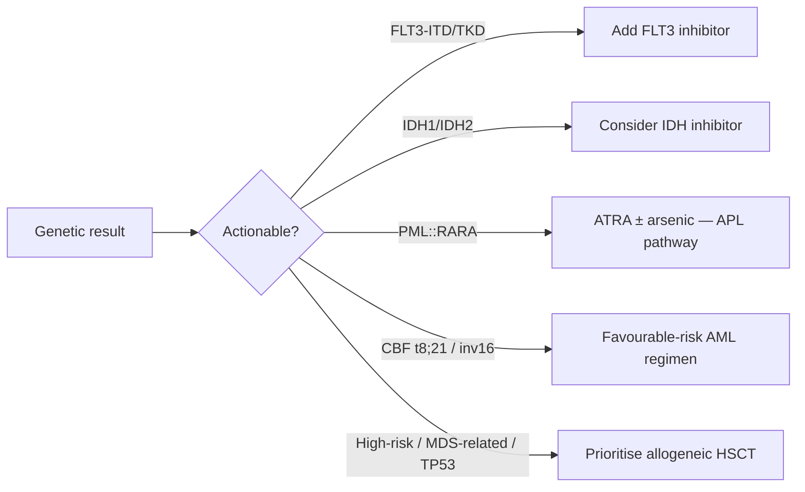

# Cytogenetics & Molecular

> [!abstract] Snapshot
> Genetic characterisation **assigns the WHO AML subtype**, defines **risk**, and reveals **actionable targets**. **~55% of MS carry karyotypic abnormalities.**

> [!important] Never skip genetics
> A breast MS could be **APL** (*PML::RARA*) — which is a haematological emergency requiring **ATRA ± arsenic**, not standard induction. Genetics is **not optional**.

## 🧬 Recurrent lesions in myeloid sarcoma

| Lesion | Gene fusion / mutation | Relevance to breast MS |
|---|---|---|
| **t(8;21)(q22;q22)** | *RUNX1::RUNX1T1* | **Classic MS association**; in adults may carry **worse prognosis** than the leukaemia alone |
| **inv(16) / t(16;16)** | *CBFB::MYH11* | Core-binding-factor AML; **breast/intestine/uterus** tropism |
| **t(11q23) / 11q23.3** | ***KMT2A* (MLL) rearrangement** | **Monocytic** differentiation; **skin/breast** infiltration |
| **t(15;17)** | ***PML::RARA*** (APL) | Must be **excluded** — different, urgent therapy |
| Others | monosomy 7, trisomy 8, *DEK::NUP214*, *NUP98r* | Risk stratification |
| Mutations | ***NPM1*, *FLT3*-ITD, *IDH1/2*, *CEBPA*, *JAK2* V617F** | Risk + **targeted therapy** options |

> [!note] De novo MS — frequent genetics
> De novo MS commonly shows **t(8;21), inv(16), *KMT2A* rearrangements**, and *JAK2* V617F (Chisholm 2019; Patkowska 2025).

## 🎯 Why it changes management

> [!tip] Link out
> Subtype assignment follows **[[Definition & WHO Classification|WHO 5th ed]]**; therapy implications are detailed in **[[Management]]**; prognostic weight in **[[Prognosis & Outcomes]]**.

> [!warning] Caveat on targeted/low-intensity therapy
> Efficacy of **HMA + venetoclax in extramedullary AML is unproven** and may be **inferior** to its activity in marrow AML — see [[Management]].

---
**See also:** [[Definition & WHO Classification]] · [[Immunohistochemistry & Immunophenotype]] · [[Management]] · [[Prognosis & Outcomes]]
