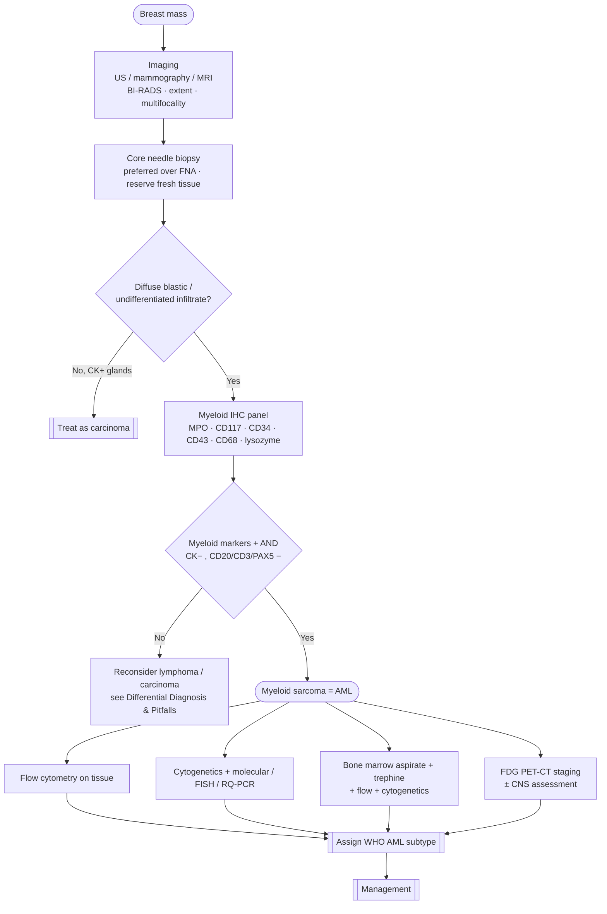

# Diagnostic Approach

> [!abstract] Snapshot
> A structured pathway: **imaging → core biopsy → myeloid IHC → flow/genetics → marrow & systemic staging**. **Core needle biopsy with a myeloid IHC panel is the single most important step.**

## 🧮 Diagnostic algorithm

## 🖼️ Imaging — *localise & stage*

> [!note] Imaging characterises but cannot diagnose
> Appearances **overlap with carcinoma and lymphoma**; tissue is always required.

| Modality | Typical finding | Role |
|---|---|---|
| **Ultrasound / mammography** | Solid, often **hypoechoic** mass; frequently **BI-RADS 4/5** | First-line characterisation |
| **Breast MRI** | Defines **extent & multifocality** | Local staging |
| **FDG PET-CT** | Maps **systemic / other extramedullary** disease | Staging, RT planning, **response assessment** |
| **CNS imaging ± LP** | — | If neurological features or high-risk biology |

## 🔪 Core biopsy & histology — *tissue is essential*

> [!important] Do
> - **Core needle biopsy** (preferred over FNA); obtain adequate tissue.
> - **Reserve fresh tissue** for [[Immunohistochemistry & Immunophenotype|flow cytometry]] and [[Cytogenetics & Molecular|genetics]].
> - Morphology: diffuse infiltrate of **medium–large immature myeloid blasts**, sometimes with eosinophilic myelocytes; touch imprints help.

> [!failure] Don't
> - Rely on **FNA alone** — rarely yields a confident diagnosis.
> - Forget **sampling error**: in a **collision tumour**, the core may capture only the carcinoma and miss the MS.

## 🧪 Confirm lineage & subtype

- **[[Immunohistochemistry & Immunophenotype]]** — the myeloid panel + flow cytometry.
- **[[Cytogenetics & Molecular]]** — assign the WHO genetic subtype; never skip (could be **APL**).

## 🦴 Bone marrow & systemic staging — *define disease extent*

> [!check] Mandatory staging set
> - **Aspirate + trephine** (morphology, blast %).
> - **Marrow flow + cytogenetics** → confirm/exclude **concurrent AML**.
> - **CNS assessment** (LP) where indicated.
> - **Baseline cardiac + performance status** before intensive chemotherapy.

> [!tip] The staging answers the key question
> Is this **isolated**, **concurrent**, **relapsed**, or **transformation** MS? → see [[Clinical Presentation]]. That determines the [[Management|treatment]] pathway.

---
**See also:** [[Immunohistochemistry & Immunophenotype]] · [[Cytogenetics & Molecular]] · [[Differential Diagnosis & Pitfalls]] · [[Management]]
