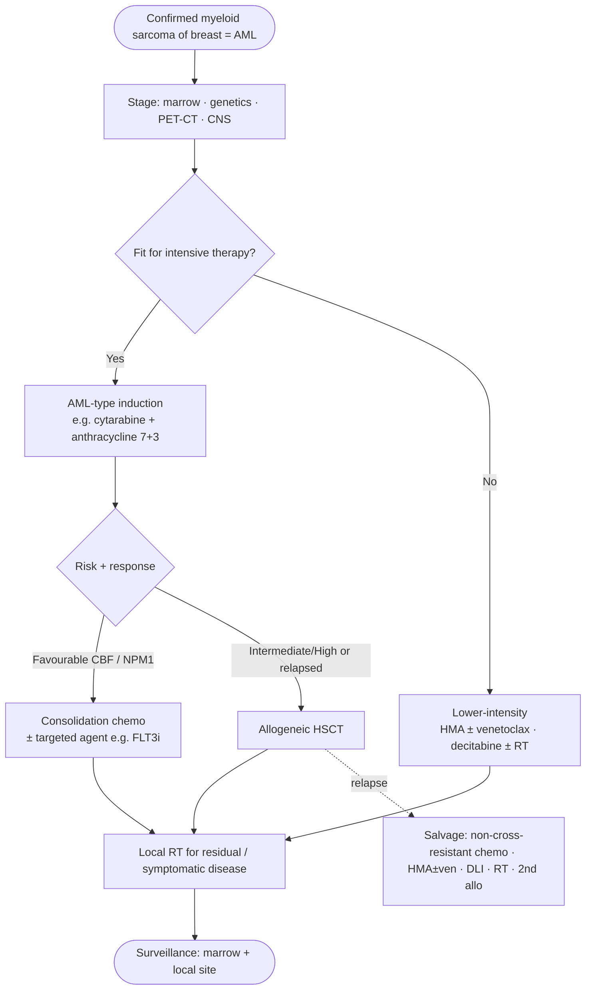

# Management

> [!abstract] Snapshot
> **Systemic AML-type therapy is the backbone** of curative-intent treatment. **Surgery and radiotherapy are adjuncts only.**

> [!important] Governing principle
> Myeloid sarcoma of the breast is **systemic AML until proven otherwise**, and is treated as such. Local measures control the visible lesion but **do not alter progression to marrow disease**.

## 🧮 Treatment algorithm

## 💉 Strategies

> [!success] 1 — Systemic AML-type chemotherapy *(cornerstone)*
> - Intensive **induction** (e.g. **"7+3"**: cytarabine + an anthracycline).
> - Applies **even to apparently isolated** breast disease.
> - **Reduces/delays/prevents marrow relapse** vs local therapy alone.

> [!info] 2 — Allogeneic stem-cell transplant *(consolidation)*
> - For fit patients, especially **higher-risk genetics or relapsed** disease.
> - **Chemo + allo-HSCT** gave significantly **longer event-free survival** than chemo alone in isolated-MS series (Antic 2012).
> - Individualised against risk, donor availability, fitness.

> [!note] 3 — Targeted & risk-adapted therapy *(where applicable)*
> - **FLT3 inhibitors** (FLT3-mutated), **IDH inhibitors**, **venetoclax**-based & **hypomethylating** regimens, CPX-351.
> - **CBF AML** [t(8;21), inv(16)] → favourable-risk regimens.
> - **APL** → ATRA-based pathway (see [[Cytogenetics & Molecular]]).
> - ⚠️ HMA + venetoclax efficacy in **extramedullary AML is unproven / possibly inferior**; favour **trial enrolment**.

> [!warning] 4 — Radiotherapy *(adjunct / local control)*
> - For **bulky, symptomatic, residual or refractory** disease, and **isolated post-transplant relapse**. Not curative alone. → see [[Radiotherapy & Local Control]].

> [!failure] 5 — Surgery *(diagnostic, not therapeutic)*
> - Role is essentially **diagnostic** (adequate tissue) or relief of symptomatic compression.
> - **Mastectomy / wide excision alone does not prevent progression to AML.**
> - **Avoid disfiguring surgery** in favour of systemic treatment.

## 🪜 A pragmatic pathway

1. **Tissue diagnosis** — core biopsy + [[Immunohistochemistry & Immunophenotype|myeloid IHC]].
2. **Stage** — [[Diagnostic Approach|marrow, genetics, PET-CT, ± CNS]].
3. **Systemic induction** — AML-type, regardless of apparently isolated disease.
4. **Consolidate** — risk-adapted; **allo-HSCT** in selected patients.
5. **Local control & follow-up** — [[Radiotherapy & Local Control|RT]] for residual/symptomatic disease; monitor marrow + local site.

> [!quote]
> *Treat the leukaemia, not just the lump.*

---
**See also:** [[Radiotherapy & Local Control]] · [[Cytogenetics & Molecular]] · [[Prognosis & Outcomes]] · [[References]]
