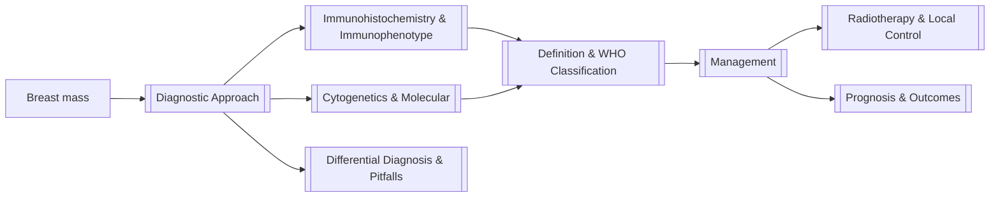

# 🩸 Myeloid Sarcoma of the Breast — Deep Wiki

> [!abstract] Map of Content (MOC)
> A clinician's deep wiki on **myeloid sarcoma (MS) of the breast** — a rare extramedullary presentation of **acute myeloid leukaemia (AML)**. Navigate the linked notes below. Classification follows the **[[Definition & WHO Classification|WHO 5th edition (2022)]]**.

> [!quote] Core teaching point
> A breast mass that proves to be **myeloid sarcoma is acute myeloid leukaemia in disguise**. Even when the marrow is clear, local excision alone is not enough — the **diagnosis turns on a myeloid immunohistochemistry panel**, and the **cure turns on systemic therapy**.

---

## 🗺️ Navigate

| # | Note | What's inside |
|---|------|---------------|
| 1 | [[Definition & WHO Classification]] | WHO 5th ed (2022) & ICC 2022 placement of MS within AML |
| 2 | [[Epidemiology & Pathogenesis]] | Frequency, demographics, site tropism, biology |
| 3 | [[Clinical Presentation]] | The four clinical contexts; breast-specific features |
| 4 | [[Diagnostic Approach]] | Imaging → biopsy → staging **+ diagnostic algorithm** |
| 5 | [[Immunohistochemistry & Immunophenotype]] | The myeloid IHC panel & flow cytometry |
| 6 | [[Cytogenetics & Molecular]] | t(8;21), inv(16), KMT2A, NPM1, FLT3 … |
| 7 | [[Differential Diagnosis & Pitfalls]] | Lymphoma vs carcinoma vs MS — how not to be fooled |
| 8 | [[Management]] | Systemic AML-type therapy **+ treatment algorithm** |
| 9 | [[Radiotherapy & Local Control]] | Doses, indications, evidence |
| 10 | [[Prognosis & Outcomes]] | Survival, predictors, evidence caveat |
| 11 | [[References]] | Verified sources (DOI / PubMed) |

---

## ⚡ The 60-second summary

> [!tip] What you must remember
> 1. **It is AML.** Myeloid sarcoma is a diagnosis of AML regardless of marrow blast % — [[Definition & WHO Classification|WHO 5th ed]].
> 2. **Suspect it** in any *undifferentiated/blastic* breast malignancy, especially in a **young woman** — see [[Clinical Presentation]].
> 3. **Add MPO** to the panel — the commonest fatal error is calling it lymphoma — see [[Differential Diagnosis & Pitfalls]].
> 4. **Stage the marrow + genetics + PET-CT** — see [[Diagnostic Approach]].
> 5. **Treat systemically** (AML-type induction ± transplant); surgery/RT are *adjuncts only* — see [[Management]].

---

> [!warning] Evidence quality
> The breast-MS literature is **almost entirely case reports and small series** — there are **no breast-specific prospective trials**. Recommendations are extrapolated from MS/AML data. See [[Prognosis & Outcomes]] and [[References]].

> [!info] Provenance
> Classification content reflects the **WHO 5th edition (2022)** and **ICC 2022** from standard references. *This wiki was generated in a cloud environment without access to the local `WHO Haem Classification` Drive folder; if you share those exact files, the [[Definition & WHO Classification]] note can be updated to quote them verbatim.*

— *Blood Doctor · Dr Abdul Mannan FRCPath FCPS · for clinical education only.*
